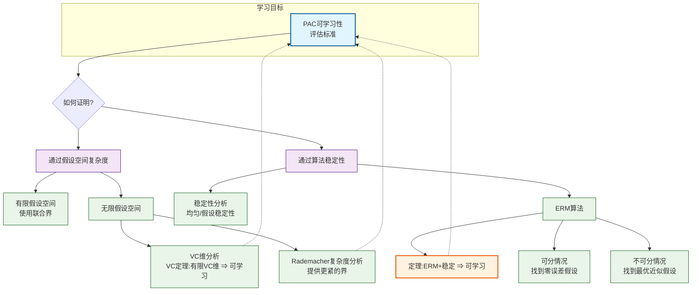

# 1.基础知识
**computational learning theory**:研究机器学习的理论基础
## 一些定义
本章主要讨论二分类问题,若无特别说明,$y_i \in \mathcal{Y} = \{-1, +1\}$
给定样例集$D = \{ (x_1, y_1), (x_2, y_2), \ldots, (x_m, y_m) \},x_i \in \mathcal{X}$,假设$\mathcal{X}$中样本都是从$\mathcal{D}$中独立同分布采用而得

令$h$为从$\mathcal{X}到\mathcal{Y}$的一个映射(==学习器学的就是这个映射h)==,其泛化误差: $$E(h; D) = P_{x \sim D}(h(x) \neq y)$$
$h$在$D$上经验误差:$$\hat{E}(h; D) = \frac{1}{m} \sum_{i=1}^{m} I(h(x_i) \neq y_i)$$
由独立同分布采样,经验误差的期望应该等于泛化误差.
简记:$E(h; D)\longrightarrow E(h)$    $\hat{E}(h; D)\longrightarrow \hat{E}(h)$
令$E(h) \le \epsilon$, $\epsilon$表示预先设定的学得模型应满足的误差要求,"误差参数"

==后文将研究经验误差与泛化误差之间的逼近程度==
若$h$在数据集上的经验误差为0,即$\hat{E}(h)=0$则称$h$与$D$一致,否则称其与D不一致
对任意两个映射$h_{1},h_{2}\in \mathcal{X}\rightarrow\mathcal{Y}$,可通过其"不合"来度量他们之间的差别$$
d(h_1, h_2) = P_{x \sim D}(h_1(x) \neq h_2(x))$$

即二者预测结果不同的概率

##  一些不等式
>![[Pasted image 20251220115914.png]]

# 2.PAC学习
概率近似正确(Probably Approximately Correct,PAC)

## 一些标记
c: "概念",$\mathcal{X}\rightarrow\mathcal{Y}$的映射.    若对任何样例$(x,y)$有$c(x)=y$成立,则称c为目标概念;
==c是定义在训练集上的,目标概念意味着经验误差为0.
c可能有很多==
$\mathcal{C}$ :所有希望学得的目标概念的集合
==我们学习的目标就是找到这个映射c==

$\mathcal{L}$: 学习算法
$\mathcal{H}$:假设空间.  这个学习算法能考虑到的所有可能概念的集合 (比如用决策树,SVM,那就有不同的假设空间$\mathcal{H_1},\mathcal{H_2}$)
==显然通常没有这么巧,$\mathcal{H}$与$\mathcal{C}$不同==
对$h \in \mathcal{H}$,不能确定$h$是不是真的概念,所以称$h$为假设

若目标概念$c \in\mathcal{H}$,则$\mathcal{H}$中存在假设能将所有样例正确分类,那么称该问题对学习算法$\mathcal{L}$是"可分的",亦称"一致的".若$c \notin\mathcal{H}$,则称"不可分的"

==我们希望$\mathcal{H}$中的c越多越好,同时$\mathcal{H}$尽可能简单,即$\mathcal{H}$尽可能接近$\mathcal{C}$==

## 定义
我们希望学的假设h尽可能接近概念c.
(*由于现实约束,会存在在训练集上等效的假设h,此时无法区分;存在各种偶然性...所以是尽可能接近*)
也就是以较大的概率,学的误差满足预设上限的模型,即=="概率""近似正确"==
>![[Pasted image 20251220122428.png]]

==泛化误差小于上限的概率大于一个预设值==
$\delta$ 表示置信度,这样的学习算法$\mathcal{L}$能以较大的概率(至少$1-\delta$)学得目标概念c的近似(误差最多为$\epsilon$)
eg:若$\epsilon=0.05,\delta=0.1$,则称$\mathcal{L}$有90%的概率将模型训练到95%的正确率

在此基础上,定义:
>![[Pasted image 20251220122917.png]]
>==样例数量满足一定条件PAC理论才认为可学习==

考虑时间问题,
>![[Pasted image 20251220123234.png]]
>==能在一定时间内解决才是高效PAC可学习.此时称$\mathcal{L}$为概念类$\mathcal{C}$的PAC学习算法==

假定学习算法$\mathcal{L}$处理每个样本的时间为常数,则时间复杂度等价于样本复杂度
>![[Pasted image 20251220123520.png]]

## PCA总结
**PAC学习给出了一个抽象地刻画机器学习能力的框架**

有一个关键因素:假设空间$\mathcal{H}$的复杂度.一般而言,$\mathcal{H}$越大,其包含任意目标概念的可能性越大,但是从中找出具体某个目标概念的难度也越大.$|\mathcal{H}|$有限时,称$\mathcal{H}$为"有限假设空间",无限时,为"无限假设空间"

下面分情况讨论

# 3.有限假设空间
## 3.1可分情形
可分,意味着$c \in \mathcal{H}$
给定包含m个样本的训练集D,如何找出满足误差参数的假设?

一种简单的想法,对每一个假设h,依次尝试,在训练集上出现了错误,则舍去.在训练集足够大的前提下,最终剩下的一个就是c. 当然,通常情况下,假设空间$\mathcal{H}$中可能存在多个等效的h.

到底需要多少个样例才能学得目标概念c的有效近似呢?
对PCA来说,只要训练集的规模能使学习算法$\mathcal{L}$以概率$1-\delta$找到目标假设的$\epsilon$近似即可

先找到在训练集上表现完美,但是泛化误差大于$\epsilon$的假设出现的概率:
	泛化误差大于$\epsilon$的概率![[Pasted image 20251220134324.png]]
	由独立同分布,h与D表现一致的概率:![[Pasted image 20251220134457.png]]
然后,令这种不好的假设出现的概率之和不大于$\delta$,解出m
	![[Pasted image 20251220135024.png]]

由此可知，有限假设空间$\mathcal{H}$都是PAC可学习的，所需的样例数目如式(12.14)所示，输出假设 h 的泛化误差随样例数目的增多而收敛到0，收敛速率为$O(\frac{1}{m})$.
## 3.2不可分情形
目标概念c不在假设空间$\mathcal{H}$中,对于任意$h\in \mathcal{H},\hat{E}(h) \not= 0$.
>![[Pasted image 20251220140018.png]]
>$\epsilon =\sqrt \frac{\ln|\mathcal{H}|+\ln(2/\delta)}{2m}$

可以证明给定假设空间$\mathcal{H}$,其中必存在一个泛化误差最小的假设.找出此假设的$\epsilon$近似也不错
so,可以将PAC学习推广到$c \notin \mathcal{H}$的情况:
>![[Pasted image 20251220140809.png]]

# 4.VC维
## 思路:
假设空间$\mathcal{H}$无限,但是样本数量m有限,所以假设h对m的预测结果有限.所以可以考虑用某种与结果相关的函数作为量化依据.

## 概念定义
我们不考虑$\mathcal{H}$的大小,而是定义$\mathcal{H}$的**增长函数**.
给定假设空间$\mathcal{H}$和示例集$D = \{x_1, x_2, \ldots, x_m\}$,$\mathcal{H}$中每个假设$h$都能对$D$中示例赋予标记,标记结果可表示为:$$h|_D = \{(h(x_1), h(x_2), \ldots, h(x_m))\}$$
**定义12.6** 对所有$m \in \mathbb{N}$,假设空间$\mathcal{H}$的增长函数$\Pi_{\mathcal{H}}(m)$为:$$\Pi_{\mathcal{H}}(m) = \max_{\{x_1, \ldots, x_m\} \subseteq \mathcal{X}} |\{ (h(x_1), \ldots, h(x_m)) \mid h \in \mathcal{H} \}|$$
==随着$m$的增大,$\Pi_{\mathcal{H}}(m)$($\mathcal{H}$中所有假设对$D$中的示例所能赋予标记的可能结果数)也增大==

增长函数$\Pi_{\mathcal{H}}(m)$表示假设空间$\mathcal{H}$对m个示例所能赋予标记的最大可能结果数.  这个值越大,$\mathcal{H}$的表示能力越强.因此,增长函数描述了假设空间$\mathcal{H}$的表示能力,由此反应出假设空间的复杂程度.

*说明:对有3个示例的二分类问题,最大的可能结果数为$2^3=8$,而假设空间$\mathcal{H}$中的所有假设赋予的标记不一定能包括这所有的8种,尽管里面有无限个$h$*

我们可以用增长函数来估计经验误差与泛化误差的关系
**定理12.2** 对假设空间$\mathcal{H},m \in \mathbb N,0<\epsilon <1$和任意$h\in \mathcal{H}$有$$P(|E(h) - \hat{E}(h)| > \epsilon) \leq 4 \Pi_{\mathcal{H}}(2m) \exp \left( -\frac{m \epsilon^2}{8} \right)$$
对二分类,m个示例,最多$2^m$种可能结果,若假设空间$\mathcal{H}$能包含所有可能的结果,即$\Pi_{\mathcal{H}}(m) = 2^m$,称示例集$D$能被假设空间$\mathcal{H}$"打散".

正式定义VC维:
**定义12.7**  假设空间$\mathcal{H}$的VC维是能被$\mathcal{H}$打散的最大示例集的大小,即$$VC(\mathcal{H}) = \max \{ m : \Pi_{\mathcal{H}}(m) = 2^m \}$$
**VC维的定义与数据分布$\mathcal{D}$无关**
*说明:$VC(\mathcal{H}) =d$表明存在大小为d的示例集能被假设空间$\mathcal{H}$打散.

>![[Pasted image 20251220164704.png]]
>![[Pasted image 20251220164717.png]]

>[!note]
>略有凌乱

...

## 结论:
==1.基于VC维的泛化误差界是分布无关、数据独立的
2.任何VC维有限的假设空间$\mathcal{H}$都是(不可知PAC)可学习的==

# 5.Rademacher复杂度
基于VC维的泛化误差界是分布无关、数据独立的,一方面具有普适性,另一方面,由于没有考虑数据自身,基于VC维得到的泛化误差界通常比较"松"

Rademacher复杂度,一定程度上考虑了数据分布.

# 6.稳定性
基于VC维或Rademacher复杂度来推导泛化误差界所得到的结果均与具体学习算法无关
**稳定性分析**希望获得**与算法有关**的分析结果.

稳定性,顾名思义,考察算法在输入发生变化时输出是否随之发生较大变化

定义训练集的变化(移除第i个样本/改变第i个样本)
定义损失函数:  $l(\mathcal{L}_D(x), y) : \mathcal{Y} \times \mathcal{Y} \rightarrow \mathbb{R}^+$  
	$l$: 损失函数
	输入: 预测标签和实际标签
	定义域($\mathcal{Y} \times \mathcal{Y}$): 预测标签的值域和实际标签的值域的这两个集合的笛卡儿积
	值域: 非负实数集
定义算法$\mathcal{L}$关于损失函数$l$满足的$\beta$-均匀稳定性

推出基于稳定性分析推导出的学习算法$\mathcal{L}$学得假设的泛化误差界
--->可得经验损失与泛化损失之间差别的收敛率为$\beta \sqrt m$,当$\beta=O(\frac{1}{m})$时,与基于VC维和Rademacher复杂度所得结果一致

注:稳定分析不必考虑假设空间中所有可能的假设

分析稳定性与可学习性之间的关系:
对损失函数$l$,若学习算法$\mathcal{L}$所输出的假设满足经验损失最小化,则称算法$\mathcal{L}$满足经验风险最小化原则,简称算法是ERM的.
(eg:线性回归,就是在最小化平方误差,就是ERM的)

若学习算法是ERM且稳定的,则假设空间$\mathcal{H}$可学习.
	不代表不是ERM就不可学习.
	不是ERM,还可以用PAC(VC维,Rademacher复杂度)等其他理论解释

**稳定性与假设空间可由损失函数 $l$ 联系起来**

# 7.总述
[[deepseek_mermaid_20251220_32e933.png|关系图]]
